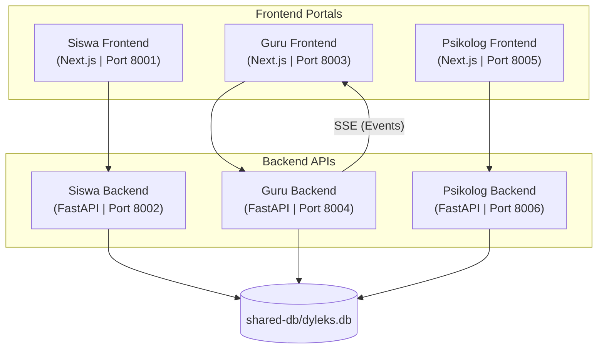

# DyLeks - Dyslexia Support and Analysis Platform

DyLeks is a multi-portal educational support system designed to assist students with dyslexia, their teachers, and consulting psychologists. Through gamified training, real-time dashboards, and clinical logs, DyLeks bridges the gap between classrooms, homes, and clinical evaluations.

---

## 1. Project Architecture

The workspace is organized into three decoupled scopes, each consisting of a Next.js frontend and a Python-based FastAPI backend, sharing a single SQLite database.



### Module Scopes

1. **[Siswa (Student)](file:///d:/dev/dyleks-new/siswa)**
   * **Frontend**: Mobile-first educational game client where students complete vowel multiple-choice questions, handwriting tasks, letter matching, and tracing work.
   * **Backend**: Integrates handwriting recognition via the `microsoft/trocr-base-handwritten` model to evaluate drawn vowels.

2. **[Guru (Teacher)](file:///d:/dev/dyleks-new/guru)**
   * **Frontend**: Interactive classroom dashboard to register students, generate QR code logins, track game performance, request AI learning plans, and read real-time activity logs.
   * **Backend**: Monitors database changes using an asynchronous file watcher (`DBWatcher`) and broadcasts updates to the dashboard via Server-Sent Events (SSE).

3. **[Psikolog (Psychologist)](file:///d:/dev/dyleks-new/psikolog)**
   * **Frontend**: Clinical assessment interface to review student handwriting tests and submit diagnostic recommendations or individualized therapy plans.
   * **Backend**: Authenticates psychologists and processes recommendations database writes.

4. **[Shared DB](file:///d:/dev/dyleks-new/shared-db)**
   * Centralized database models (`db.py`) and a mock-data seeder (`init_db.py`).

---

## 2. Technology Stack

### Languages & Runtimes
* **TypeScript** (`^5.0.0`): Strict type safety across all Next.js applications.
* **Python** (`3.12.10`): Runs the three FastAPI backend services.
* **Node.js** (`18.x` / `20.x`): Runtime environment for building/running frontends.

### Frontend Portals (Siswa, Guru, Psikolog)
* **Next.js** (`16.2.9`): React framework (App Router) for layouts, routing, and APIs.
* **React** & **React DOM** (`19.2.4`): UI rendering.
* **Tailwind CSS** & **PostCSS** (`^4.0.0`): Utility-first CSS styling engine.
* **Lucide React**: Vector icons for modern visual dashboard elements.
* **qrcode**: Renders student registration QR codes onto canvas containers.

### Backend APIs
* **FastAPI** (`0.136.1`): High-performance asynchronous API framework.
* **Uvicorn** (`0.46.0`): ASGI web server interface.
* **asyncio**: Drives background tasks like the database file watcher (`DBWatcher`) and handles Server-Sent Events (SSE).

### Database & ORM
* **SQLite3**: Single shared database (`shared-db/dyleks.db`) for lightweight, serverless relational storage.
* **SQLAlchemy** (`2.0.49`): Object-relational mapping tool to model database tables as Python objects.

### Machine Learning & OCR (Siswa Backend)
* **PyTorch** & **Transformers**: Lazy-loads the `microsoft/trocr-base-handwritten` OCR model on-demand for vowel handwriting evaluation.
* **Pillow (PIL)**: Preprocesses drawn handwritten images before classification.
* **python-multipart**: Handles file upload requests.

---

## 3. Requirements

* **Node.js**: Version `18.x` or `20.x` (with `npm`)
* **Python**: Version `3.12.10` (as defined in `.python-version`)
* **SQLite3**
* **System memory/CPU**: Enough resources to run the handwriting OCR model locally (or use the fast simulated fallback when hardware limits are met).

---

## 4. Getting Started

Follow these steps to initialize and start the entire ecosystem.

### Step 1: Database Initialization
Before running the services, create and seed the SQLite database using Python:

```bash
# In the root of the project
python shared-db/init_db.py
```
This script creates `shared-db/dyleks.db` and populates it with mock students, teacher accounts (`username: bu_siti`, `password: password123`), psychologist accounts (`username: dr_diana`, `password: password123`), recommendations, and starting game logs.

### Step 2: Start Python Backends
Open separate terminal windows or run them in the background.

* **Siswa Backend** (Port `8002`):
  ```bash
  cd siswa/backend
  pip install -r requirements.txt  # Ensure FastAPI, torch, and transformers are installed
  python -m uvicorn app.main:app --host 0.0.0.0 --port 8002 --reload
  ```

* **Guru Backend** (Port `8004`):
  ```bash
  cd guru/backend
  python -m uvicorn app.main:app --host 0.0.0.0 --port 8004 --reload
  ```

* **Psikolog Backend** (Port `8006`):
  ```bash
  cd psikolog/backend
  python -m uvicorn app.main:app --host 0.0.0.0 --port 8006 --reload
  ```

### Step 3: Start Frontend Applications
Open separate terminal windows for each frontend.

* **Siswa Frontend** (Port `8001`):
  ```bash
  cd siswa/frontend
  npm install
  npm run dev
  ```
  Access the student portal via [http://localhost:8001](http://localhost:8001).

* **Guru Frontend** (Port `8003`):
  ```bash
  cd guru/frontend
  npm install
  npm run dev
  ```
  Access the teacher portal via [http://localhost:8003](http://localhost:8003).

* **Psikolog Frontend** (Port `8005`):
  ```bash
  cd psikolog/frontend
  npm install
  npm run dev
  ```
  Access the psychologist portal via [http://localhost:8005](http://localhost:8005).
